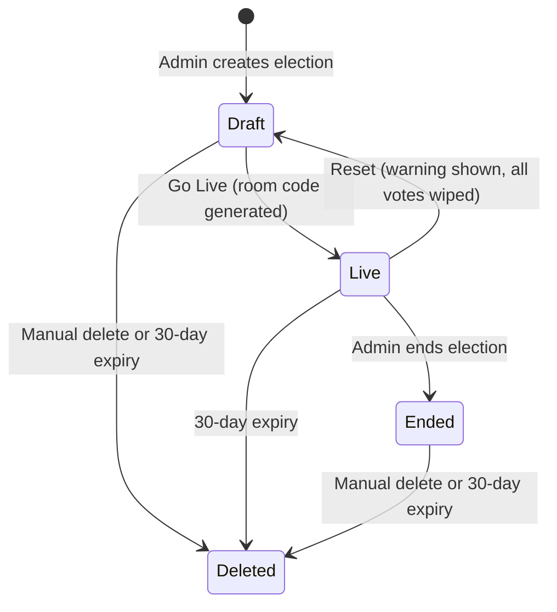
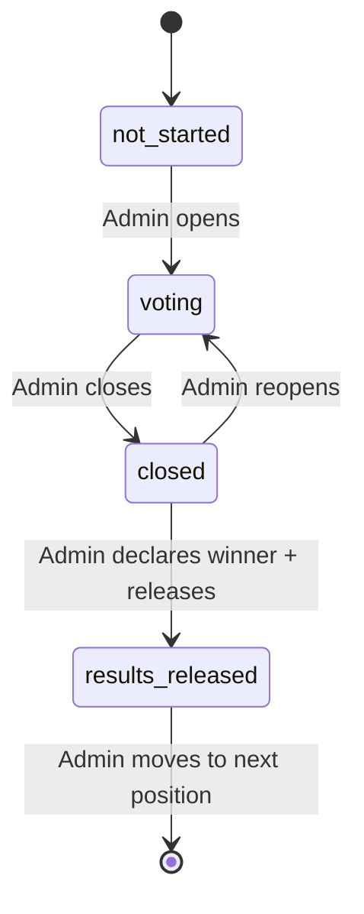
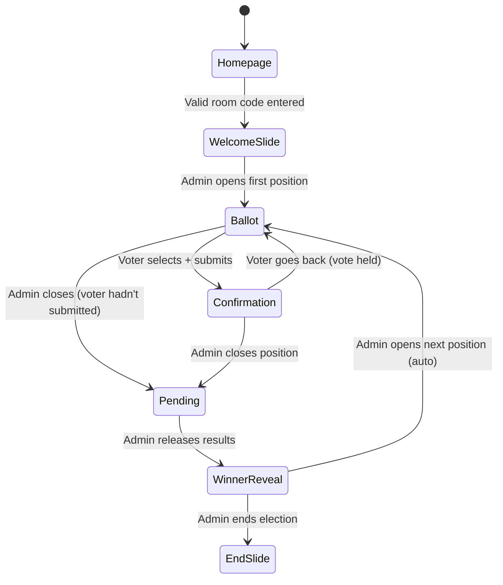
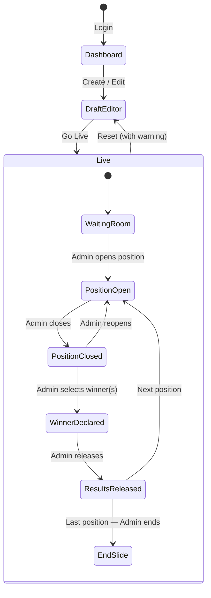

# VoteMachine — Product Specification
*Version 1.0 — 2026-05-02*

---

## 1. Overview

VoteMachine is a mobile-first web application that allows organizations to run live, real-time elections. An authenticated admin configures and controls the election. Anonymous voters join via a 4-letter room code and vote from their phones. The admin sees live vote tallies and controls the pace. Results are released to voters only when the admin chooses.

---

## 2. Users

| Role | Auth | How they access |
|---|---|---|
| **Admin** | Username + password (Firebase Auth, fake email under the hood) | Creates account, logs in, manages elections |
| **Voter** | Anonymous (Firebase Anonymous Auth, invisible to user) | Goes to homepage, enters room code |

---

## 3. Core Constraints

- Free hosting (Firebase Hosting + free tier)
- Mobile-first (Android + iPhone, browser-based)
- ~30 simultaneous voters per session
- Up to ~8 positions per election, 1–5 candidates per position
- No email required for admin signup
- Forgotten password = permanently locked out (acceptable)

---

## 4. Election Lifecycle

### States

```
draft → live → ended → deleted
         ↑______↓ (reset: wipes all votes)
```

| State | Description |
|---|---|
| `draft` | Admin is configuring. No room code exists. Voters cannot join. |
| `live` | Room code generated. Voters can join. Positions are being voted on. |
| `ended` | All positions done. End slide visible to voters. Results stored. |
| `deleted` | Manually deleted by admin, or 30-day auto-expiry fired. |

### Transitions

- **draft → live**: Admin clicks "Go Live." Room code is generated (4 uppercase letters, random). Election is now joinable.
- **live → draft**: Admin clicks "Reset." Warning shown: *"This will delete all votes and results. This cannot be undone."* On confirm: all votes wiped, room code destroyed, back to draft.
- **live → ended**: Admin ends election after final position results are released.
- **any → deleted**: Admin manually deletes, or 30 days pass since `createdAt`.

### Abandoned Elections

If admin exits without ending: election stays `live`. Voters on the page remain frozen on their current screen. Admin can return, log in, and resume from the exact state they left (current position, current position status). Voters who disconnected must rejoin with the room code.

### Editing a Live Election

Admin cannot edit a `live` election directly. They must reset it to `draft` first (which wipes all results).

---

## 5. Admin Experience

### 5.1 Authentication

- Sign up: choose username + password. No email required. Username stored in Firestore; fake email (`{username}@votingapp.com`) used internally for Firebase Auth.
- Log in: username + password.
- No password reset. Forgotten password = account inaccessible.

### 5.2 Dashboard

- List of all elections the admin has created (all states).
- Can have multiple elections in any state simultaneously.
- Actions per election: Edit (draft), Resume (live), View Results (ended), Delete.

### 5.3 Draft Editor

Admin configures the election before going live:

**Election Settings:**
- Election name/title (shown to voters on welcome slide)

**Positions:**
- Add, rename, delete, reorder positions (drag to reorder)
- Each position has an ordered list of candidates (add, rename, delete, reorder)
- Candidate names are freeform text (e.g., `"John Smith"`, `"Smith / Jones"` for a ticket)
- 1–5 candidates per position

**Configurable Slides:**

| Slide | When shown to voters | Configurable fields |
|---|---|---|
| Welcome Slide | After joining, before voting starts | Message, background color |
| Pending Slide | After admin closes a position, before results released | Message, background color |
| End Slide | After admin ends the election | Message, background color, toggle: show winner list |

End Slide winner list: all positions in order, each with their winner(s). Multiple winners displayed as `"Name A and Name B"`.

### 5.4 Live Session — Admin Control Panel

Admin sees a dedicated control panel (separate UI from voter view).

**Header:**
- Election name
- Room code (large, copyable)
- Connected voter count (live, updates in real-time — decrements when voters disconnect)

**Position Control (linear, one at a time):**

For the current position, admin can:
- **Open Voting** — opens ballot to all connected voters
- **Close Voting** — locks ballot, voters move to pending slide
- **Reopen Voting** — if closed by mistake, reopens ballot (voters auto-transition back)
- **View Tally** — live per-candidate vote count (visible to admin only at all times once any votes are cast)
- **Declare Winner(s)** — after closing, admin selects one or more candidates as winner(s). UI highlights the highest vote-getter(s) as a suggestion. Admin has final say. Multiple winners supported.
- **Release Results** — pushes winner(s) to all voter screens
- **Next Position** — advances to next position in order (only available after results released)
- **End Election** — available after the last position's results are released

Admin can navigate back to re-examine any previously completed position's results.

**Tally Display (admin only):**
- Shows candidate name + vote count for the current position
- Highest vote-getter visually highlighted
- Total votes cast shown alongside connected voter count

---

## 6. Voter Experience

### 6.1 Joining

1. Voter goes to the app homepage.
2. Enters the 4-letter room code.
3. If code is valid and election is `live`: voter joins and receives a Firebase Anonymous Auth session. Their `sessionId` (anonymous auth UID) is stored in `localStorage` and used to track votes and prevent double-voting.
4. If code is invalid or election is not `live`: error message shown.

### 6.2 Screen States

Voters have no navigation controls. All screen transitions are triggered by admin actions and happen automatically.

```
Welcome Slide
    ↓ (admin opens first position)
Ballot
    ↓ (voter selects + submits)
Confirmation
    ↓ (admin closes position)        ← also: Ballot → Pending if voter hadn't submitted
Pending Slide
    ↓ (admin releases results)
Winner Reveal
    ↓ (admin opens next position — auto)    OR    ↓ (admin ends election)
Ballot (next position)                            End Slide
```

### 6.3 Ballot

- Shows position name and list of candidates in admin-defined order.
- Radio-button style selection: one candidate at a time.
- "Submit Vote" button — disabled until a candidate is selected.
- "Go Back" button shown after submitting (in Confirmation state) — returns to ballot. The previous vote is **held** (not rescinded) until the voter selects a new candidate and submits again.
- Voters cannot abstain. Must select a candidate to submit.

### 6.4 Confirmation State

- Shown after voter submits.
- Displays: "Your vote for [Candidate Name] has been recorded."
- "Go Back" button available to change vote (while position is still open).

### 6.5 Pending Slide

- Shown when admin closes the position.
- Ballot locks immediately — "Go Back" option disappears.
- Displays the configured pending slide message + background color.
- Voters who had not yet submitted simply miss that position's vote.

### 6.6 Winner Reveal

- Shown when admin releases results.
- Displays: position name + winner name(s).
- Multiple winners: `"[Position]: Name A and Name B"`
- Persists until admin opens the next position.
- Voter screen auto-transitions to the next ballot (no tap required).

### 6.7 End Slide

- Shown when admin ends the election.
- Displays configured end slide message + background color.
- If admin toggled "show winner list": all positions listed in order, each with their winner(s).

### 6.8 Mid-Election Join

- If a voter joins after some positions are already closed/completed, they land on whatever the current state is (welcome slide, active ballot, pending, etc.).
- They do not see a summary of completed positions.

### 6.9 Rejoin After Disconnect

- Voter goes back to homepage, enters the same room code.
- Their `sessionId` is retrieved from `localStorage` — they are recognized as the same device.
- Any votes already cast for closed positions are preserved.
- They resume at the current screen state.

---

## 7. Double-Vote Prevention

**Mechanism:**
1. On first visit, Firebase Anonymous Auth generates a UID stored in `localStorage` as `sessionId`.
2. When a vote is submitted, a Firestore document is written at path `votes/{positionId}_{sessionId}`.
3. Before accepting a vote write, Firestore security rules verify this document does not already exist.
4. On page refresh: `sessionId` is retrieved from `localStorage` — same device, same session.

**Scope:** One vote per device per position. Not hardened against incognito mode or device switching (acceptable per spec).

---

## 8. Data Schema

### Firestore

```
/users/{userId}
  username:         string
  createdAt:        timestamp

/elections/{electionId}
  adminId:                string        // Firebase Auth UID
  name:                   string        // "Springfield HOA Elections 2026"
  status:                 'draft' | 'live' | 'ended' | 'deleted'
  roomCode:               string | null // 4 uppercase letters; null when draft
  currentPositionId:      string | null // positionId of active position
  currentPositionStatus:  'voting' | 'pending' | 'results_released' | null
  welcomeSlide:           { message: string, backgroundColor: string }
  pendingSlide:           { message: string, backgroundColor: string }
  endSlide:               { message: string, backgroundColor: string, showWinners: boolean }
  createdAt:              timestamp
  lastActiveAt:           timestamp     // updated on any admin action
  expiresAt:              timestamp     // createdAt + 30 days

/elections/{electionId}/positions/{positionId}
  name:       string        // "President"
  order:      number        // 0, 1, 2... — defines sequence
  status:     'not_started' | 'voting' | 'closed' | 'results_released'
  winnerIds:  string[]      // candidateIds; empty until admin declares

/elections/{electionId}/positions/{positionId}/candidates/{candidateId}
  name:       string        // freeform: "John Smith" or "Smith / Jones"
  order:      number        // admin-set display order on ballot
  voteCount:  number        // atomic increment counter for real-time display

/elections/{electionId}/votes/{positionId}_{sessionId}
  sessionId:    string      // Firebase Anonymous Auth UID
  positionId:   string
  candidateId:  string
  votedAt:      timestamp
```

**Note on vote storage:** Both an individual vote record (for dedup + audit) AND an atomic counter on the candidate document (for fast real-time display) are maintained. These are written in a single Firestore transaction.

### Firebase Realtime Database (Presence Only)

```
/presence/{roomCode}/{sessionId}: true
```

Written when voter joins. Auto-deleted by `onDisconnect()` when voter loses connection. Admin reads the count of keys under their room code for the live connected voter count.

---

## 9. Security Model

### Firestore Security Rules (intent)

| Path | Read | Write |
|---|---|---|
| `/users/{userId}` | Owner only | Owner only |
| `/elections/{electionId}` | Admin (by adminId) OR voter with valid roomCode + live status | Admin only |
| `/elections/{electionId}/positions/**` | Anyone who can read the election | Admin only |
| `/elections/{electionId}/votes/{voteId}` | Admin only | Voter: sessionId must match, document must not already exist |

### Firebase Anonymous Auth for Voters

Voters are silently signed in with Firebase Anonymous Auth when they join. Their UID becomes their `sessionId`. This gives them a verifiable identity in Firestore security rules without requiring any signup flow.

---

## 10. State Machine Diagrams

### Election Lifecycle



### Position Lifecycle



### Voter Screen Flow



### Admin Live Session Flow



---

## 11. Page / Component Map

### Pages (Routes)

| Route | Who sees it | Description |
|---|---|---|
| `/` | Voters + unauthenticated | Homepage: room code entry + link to admin login |
| `/login` | Admins | Login + signup form |
| `/dashboard` | Admins | List of all elections |
| `/election/:id/edit` | Admin (owner) | Draft editor |
| `/election/:id/live` | Admin (owner) | Live control panel |
| `/vote` | Voters | All voter states rendered here (Welcome → Ballot → Pending → Reveal → End) |

### Key Components

**Admin:**
- `ElectionCard` — dashboard list item (name, status, actions)
- `PositionEditor` — drag-to-reorder list of positions + inline candidate editing
- `SlideConfigurator` — message + color picker for welcome/pending/end slides
- `LiveHeader` — room code, voter count, election name
- `PositionController` — open/close/reopen controls + status indicator
- `LiveTally` — real-time per-candidate vote bars
- `WinnerSelector` — multi-select candidates, highlights leader, confirm button
- `ResultsReleaseButton`

**Voter:**
- `WelcomeSlide`
- `BallotView` — candidate list (radio select) + submit button
- `ConfirmationView` — vote recorded message + go back button
- `PendingSlide`
- `WinnerReveal` — position name + winner name(s)
- `EndSlide` — message + optional winners list

---

## 12. Edge Cases

| Scenario | Behavior |
|---|---|
| Voter submits vote then admin closes position before they confirm | Vote is locked in at whatever was last submitted |
| Voter hasn't voted when admin closes position | Voter transitions to pending; their vote is not recorded for that position |
| Admin closes position too early | Admin can reopen; voters auto-transition back to ballot |
| Admin's browser crashes mid-session | Admin logs back in, sees live election, resumes at exact state |
| Two voters share a device | Second voter cannot vote (same `sessionId` in localStorage) |
| Room code collision | On generation, check Firestore for existing live election with same code; regenerate if collision found |
| Admin tries to go live with 0 positions | Blocked with validation error |
| Admin tries to go live with a position that has 0 candidates | Blocked with validation error |

---

## 13. Out of Scope (v1)

- Email-based auth or password reset
- Voter identification / named voting
- Ranked choice voting
- Time limits per position
- Results export (PDF, CSV)
- Multiple admins per election
- Voter-facing live tally
- Election templates
